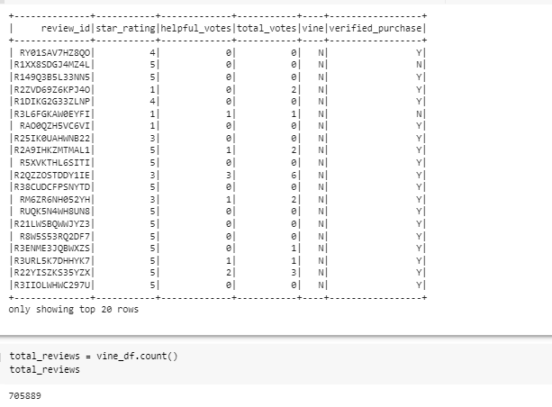
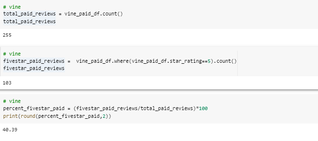
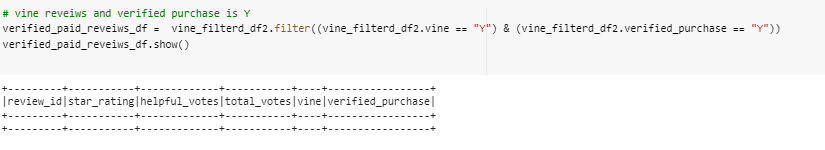
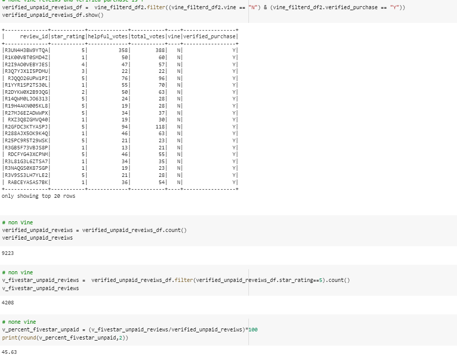

# **Big Data**
# **Amazon_Vine_Analysis**

## **Overview of the analysis** 

* One of BigMarket's client is SellBy. SellBy wants to know how the review of their products compared to the review of similar products sold by their competitors. They are also interested on enrolling on a program that gives out free products to select reviewers, but they want to know if it is worth the cost. 
* In this challenge we will be analyzing Amazon reviews written by members of the paid Amazon Vine program. The Amazon Vine program is a service that allows manufacturers and publishers to receive reviews for their products. Companies like SellBy pay a small fee to Amazon and provide products to Amazon Vine members, who are then required to publish a review.

* In this project, we will have access to 50 datasets. Each one contains reviews of a specific product, from clothing apparel to wireless products. we will need to pick one of these datasets and use PySpark to perform the ETL process to extract the dataset, transform the data, connect to an AWS RDS instance, and load the transformed data into pgAdmin. Next, we will use PySpark, Pandas, or SQL to determine if there is any bias toward favorable reviews from Vine members in the dataset. Then, we will write a summary of the analysis to submit to the SellBy stakeholders

### Purpose 

- Perform ETL on Amazon Product Reviews
- Determine Bias of Vine Reviews and if having a paid Vine review makes a difference in the percentage of 5-star reviews
- Also write a Report on the Analysis

## **Results** 

### total records of dataset

* I chose to use Home Entertainment dataset and there are 705889 records
* we filtered the dataframe to rows where the total_votes count is equal to or greater than 20 
* the dataset is then filtered to all the rows where the number of helpful_votes divided by total_votes is equal to or greater than 50 percent
* after this dataframe is reduced to 22930 records/reviews

### Vine(paid) Reviews 

### non-Vine(unpaid) Reviews 

* How many Vine reviews and non-Vine reviews were there? 
	- from the image above there are 255 Vine/paid reviews and 22675 non-Vine/unpaid reviews

* How many Vine reviews were 5 stars? How many non-Vine reviews were 5 stars? 
	- 103 of the Vine reviews were 5 stars, 10310 of non-vine reviews were 5 stars

* What percentage of Vine reviews were 5 stars? What percentage of non-Vine reviews were 5 stars?
	- As we can see from the image above 40 percentage of the total vine reviews are 5 stars and 45 percentage of the total non-Vine/unpaid reveiws are 5 stars. 

## **Summary** 
* From the image above we can see that 40 percentage of the total vine reviews are five starts, while 45 percentage of the total non-Vine reviews are five stars. The percentages of five stars in vine/paid reviews are below 50 and lower than in the unpaid reviews. The paid population is small verses the unpaid population.There are 255 total vine reviews and not many helpful reviews compared to 22675 total unpaid reviews. The percentages might look very close but volumes are very different(there are 103 vine five star reviews verses 10310 non vine 5 star reviews). We can also say that having a paid vine reveiw does not make a difference in the percentage of 5-star reveiws for this dataset.

### Verified purchase for Vine 

* I also included another analysis, the verified purchase column. From the first image above we can see that for all 225 vine reviews, there are no verified purchase.

### Verified purchase for non-Vine 

 

* Form the image above, we can see that for the unpaid program, there are 9233 reviews with verified purchase(Y). This means out of the total unpaid reviews, 92300 purchased a product. There are 4208 Five stars reviews of the total unpaid reviews. The percentage of the non-Vine 5 stars is 46 of the total unpaid reviews. This shows that there is positive bias for the reviews in the vine program since none of 255 vine reviews purchased a product. Their feedback might not be helpful since they have limited or no experience with the product.

* An additional analysis is recommended to support the statement
	- we can also calculate the mean, median and standard deviation of the vine and non vine datasets(star_rating) and this will help us with the distribution of the data.
	- we also need to check the reveiws column
	- we also need to run other datasets out of 49 datsets through the same anaysis and see if we get the same results.

* In conclusion, vine paid program is not worth it for the Home Entertainment section, as the five-star percentage is lower than 50. Like I mentioned above this analysis is only for this dataset, and we cannot make the final conclusion if the vine program is worth it or not for all products. We must analyze all the datasets first.

	

